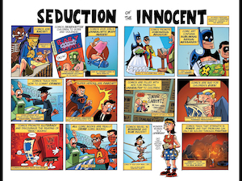
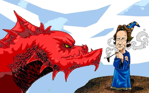
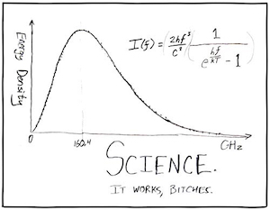

<table class="wide">
<tr>
  <td class="left">
    
  </td>
  <td class="right">
    
  </td>
</tr>
<tr>
  <td class="left">
    
  </td>
  <td class="right">
    
  </td>
</tr>
</table>
<!-- Meu comentário em HTML

  

      <ul class="nav">

                <li><a href="http://itxesco.github.io/pages/favoritos.html">favoritos</a></li>

      </ul>
  

-->
